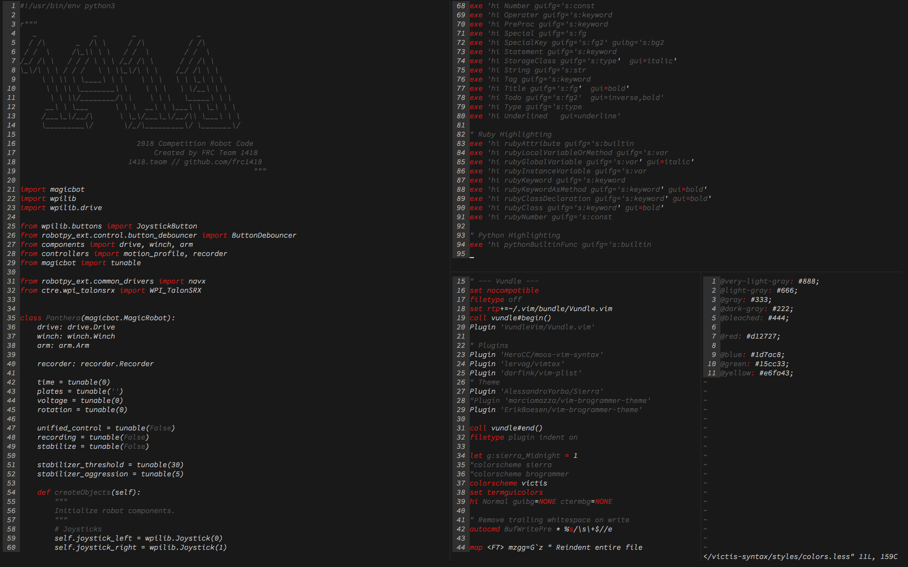

# vim-syntax-victis
> Team 1418's syntax theme for vim.



## Installation
First, install the plugin with your favorite plugin manager.

- [NeoBundle][neobundle]

    ```vim
    NeoBundle 'HeroCC/moos-vim-syntax'
    ```

- [Vundle][vundle]

    ```vim
    Bundle 'HeroCC/moos-vim-syntax'
    ```

- [Pathogen][pathogen]

    ```sh
    git clone git://github.com/HeroCC/moos-vim-syntax.git ~/.vim/bundle/moos-vim-syntax
    ```

- [vim-plug][vim-plug]

    ```vim
    Plug 'HeroCC/moos-vim-syntax'
    ```

### If using theme in terminal
If you wish to use vim in the terminal, you will need to add the following line to your `.vimrc`:
```
set termguicolors
```
This will force the use of GUI colors in your terminal.

## License

Provided under the [MIT License](LICENSE).

[neobundle]: https://github.com/Shougo/neobundle.vim
[vundle]: https://github.com/gmarik/vundle
[pathogen]: https://github.com/tpope/vim-pathogen
[vim-plug]: https://github.com/junegunn/vim-plug
